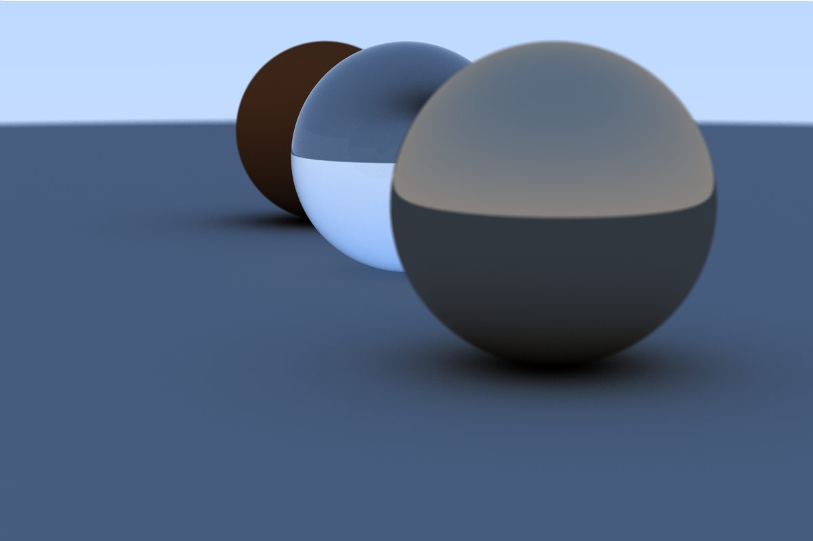

# SceneEngine

SceneEngine is an in progress script based animation/rendering tool.

Here is an example of a scene file that describes the final render of "Ray Tracing in One Weekend":

```
config := {
    aspect_ratio: (3.0 / 2.0),
    image_width: 1200,
    samples: 500,
    depth: 50
}

export scene(config, func(frame, seconds) {
    object(
        sphere(vec3(0, 1, 0), 1),
        dielectric(1.5)
    )

    object(
        sphere(vec3(-4, 1, 0), 1),
        lambert(color(102, 51, 25))
    )

    object(
        sphere(vec3(4, 1, 0), 1),
        metal(color(178, 153, 127), 0.0)
    )

    // Ground sphere
    object(
        sphere(vec3(0, -1000, 0), 1000),
        lambert(color(127, 127, 127))
    )

    camera(
        vec3(13, 2, 3),
        vec3(0, 0, 0),
        20
    )
})
```

Which outputs:



# Development

Requirements:
- [Go >= 1.20](https://go.dev)
  - [raylib dependencies](https://github.com/gen2brain/raylib-go)
- [Pony >= 0.54.1](https://www.ponylang.io)

Running:
```bash
./se run
```